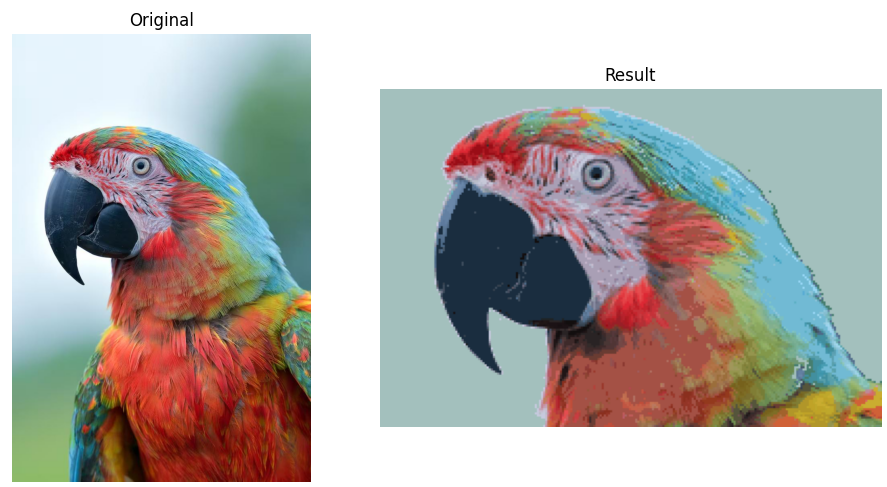
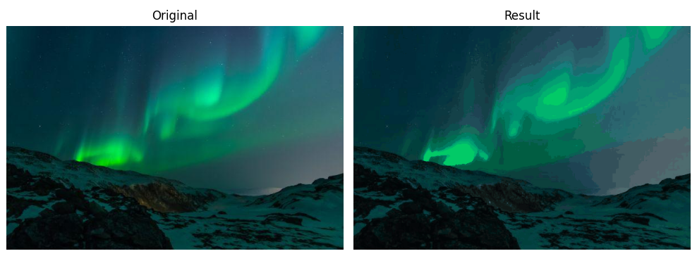
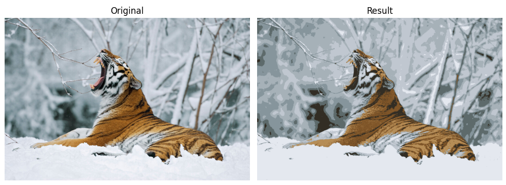

# imol

This tool is a personal, experimental CLI utility, not a polished or fully error-hardened application.
It was written for my own use to quickly:

* convert image formats

* resize or crop images

* reduce colors using clustering methods

## CLI Reference

In this tool, processing always happens in the following order:

```
open → crop → resize → color clustering → save and show
```

Each group of arguments controls **one stage** of this pipeline.
Arguments only have an effect when their stage is active.

---

### 1. Input

| Argument | Description         |
| -------- | ------------------- |
| `INPUT`  | Path to input image |

The input image is always required.
All further operations are applied to this image in order.

---

### 2. Save & Output

This group controls **writing the final image to disk**.

| Argument       | Description      | Default           |
|----------------| ---------------- | ----------------- |
| `-s, --save`   | Enables saving   | disabled          |
| `-o, --output` | Output file path | auto-generated    |
| `-t, --to`     | Output format    | inferred or `png` |

Saving only happens when `--save` is present.
If `--save` is not given, the image is processed but not written.

---

### 3. Preview & Info

This group controls **inspection**, not processing.

| Argument      | Description                        | Default |
| ------------- | ---------------------------------- | ------- |
| `-sh, --show` | Show original and processed images | off     |
| `-z, --size`  | Print image size and exit          | off     |

`--show` displays the images after processing.

`--size` prints the input image size and exits immediately.
When `--size` is used, no other operation is performed.

---

### 4. Crop

This stage modifies the image geometry by cropping.

| Argument     | Description                      | Default |
| ------------ | -------------------------------- | ------- |
| `-c, --crop` | Crop box `LEFT,TOP,RIGHT,BOTTOM` | none    |

Cropping is applied only when `--crop` is provided.

Example:

```bash
-c 10,10,300,300
```

---

### 5. Resize

This stage changes the image resolution.

| Argument            | Description                                | Default   |
| ------------------- | ------------------------------------------ | --------- |
| `-r, --resize`      | Resize to `WIDTHxHEIGHT`                   | none      |
| `-m, --resize-mode` | Resize behavior (`fit`, `fill`, `stretch`) | `stretch` |

Resizing is applied only when `--resize` is provided.
`--resize-mode` has an effect only together with `--resize`.

Resize always happens **before** color clustering.
Resizing is strongly recommended before DBSCAN.

---

### 6. Color Clustering

This stage reduces the number of colors in the image.

| Argument                | Description             | Default  |
| ----------------------- | ----------------------- | -------- |
| `-cm, --cluster-method` | Clustering algorithm    | `median` |
| `-k, --colors`          | Target number of colors | none     |

Color clustering is activated when either:

* `--colors` is provided, or
* DBSCAN mode is enabled

For non-DBSCAN methods, `--colors` specifies the exact target palette size.

If no clustering arguments are given, the image colors are left unchanged.

---

### 7. DBSCAN

This mode extracts **dominant colors**, rather than enforcing a fixed count.

| Argument                    | Description                | Default   |
| --------------------------- | -------------------------- | --------- |
| `-db, --dbscan`             | Enable DBSCAN clustering   | off       |
| `-de, --dbscan-eps`         | Color similarity radius    | `8.0`     |
| `-dm, --dbscan-min-samples` | Minimum pixels per cluster | `100`     |
| `-mc, --max-colors`         | Maximum output colors      | unlimited |

DBSCAN mode is active only when `--dbscan` is specified.

In this mode,`--colors` is not used.
DBSCAN is memory-intensive.
Images should always be resized before enabling this mode.

---

### 8. Examples

Resize and save:

```bash
./imol image.jpg -r 512x512 -s
```

Convert format:

```bash
./imol image.jpg -t webp -s
```

Reduce to 8 colors using k-means:

```bash
./imol image.jpg -k 8 -cm kmeans -sh
```

Extract dominant colors using DBSCAN:

```bash
./imol logo.png -r 128x128 -db -de 6 -dm 300 -mc 5 -s
```

---
## Example Results

| Result |
|--------|
| <div align="center"><br><br><code>./imol input/1.jpg -c 0,200,740,700 -r 240x162 -db -de 3 -dm 5 -sh</code></div> |
| <div align="center"><br><br><code>./imol input/2.png -k 64 -sh</code></div> |
| <div align="center"><br><br><code>./imol input/3.jpg -k 8 -cm kmeans -sh</code></div> |
